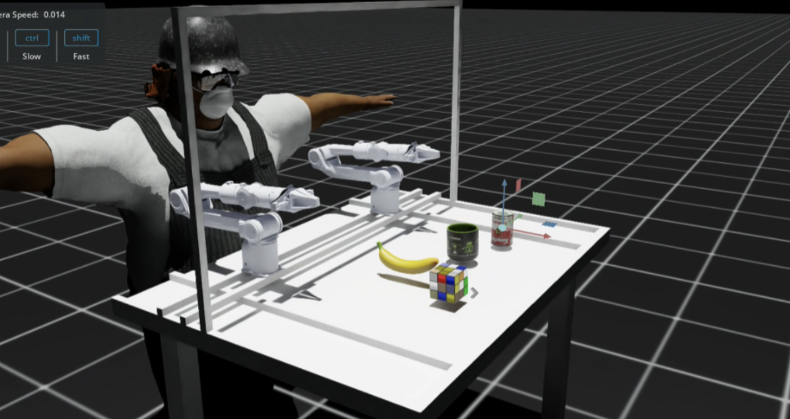

# Arm Simulation Environment Set Up
This repository is designed for setting up an environment for training robotics arm to grab objects in Isaac Sim. The goal is to guide through developers to design their own task for the arm to train using examples files.

<p align="center">

</p>

# How to run
Find the `isaaclab.sh` file in your `IssacSim -> IssacLab` folder, it could be stored somewhere else. In the same directory where you store the `isaaclab.sh` file, run:
```bash
sudo-root ./isaaclab.sh -p <your-path-to-this-directory>/scripts/zi/arm/src/main.py
```


